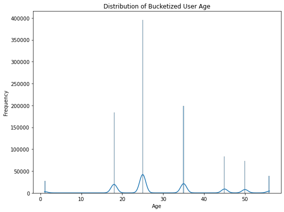
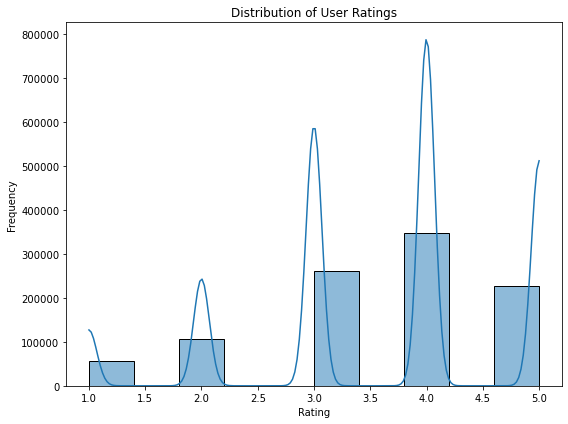
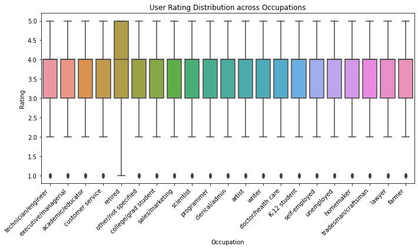

# PROJECT TITLE : BOOSTING USER ENGAGEMENT VIA GENRE INSIGHTS

# PROJECT OVERVIEW
This project focuses on the analysis and modeling of user preferences and movie ratings using the MovieLens dataset. The dataset is composed of three separate files: movies.csv, ratings.csv, and users.csv, each providing critical information about movies, user interactions, and demographic attributes. The data was first cleaned to handle missing values, standardize formats, and ensure consistency across datasets. Following this, the datasets were merged into a single comprehensive DataFrame, df_Merged, to enable an integrated analysis of user behavior and movie features.

# PROBLEM STATEMENT
Streaming platforms and movie services struggle to retain users due to irrelevant recommendations and underutilized content categories. By analyzing movie metadata such as genres, titles, and missing poster URLs, we aim to improve content organization, recommendability, and engagement on the platform.

# DATA UNDERSTANGING
The MovieLens dataset provides a rich source of information on user interactions with movies, combining user demographics, movie metadata, and user ratings. This project uses three main datasets:

### movies.csv
Contains metadata about movies, including:

movie_id: Unique identifier for each movie.

movie_title: Name of the movie.

movie_genres: Genres associated with the movie (e.g., Action, Comedy).

### ratings.csv
Captures user interactions with movies:

user_id: Unique identifier for each user.

movie_id: References the movie being rated.

user_rating: Rating score given by the user (typically from 1 to 5).

timestamp: Unix timestamp of when the rating was made.

### users.csv
Provides demographic information about users:

user_id: Unique identifier matching the ratings data.

user_gender: Boolean or binary representation of gender.

user_age: User's age (later bucketized).

user_occupation_label and user_occupation_text: Numerical and textual descriptions of user occupations.

user_zip_code: Geographical identifier.

After preprocessing, these datasets were merged into a single unified DataFrame, df_Merged, which allows for joint analysis across user profiles, movie metadata, and rating behavior.

### Key derived or cleaned fields include:

bucketized_user_age: Age groups created for easier analysis.

user_gender_str: Converted gender to readable labels (e.g., Male, Female).

high_rating: A binary classification where a rating of 4 or above is considered "high."

This merged dataset forms the foundation for exploratory data analysis (EDA), trend identification, user segmentation, and building a basic recommendation model.

# ANALYSIS
1. Distribution of Bucketized User Age

2. Gender Distribution
   

3. Distribution of user ratings
   

4. Rating Distributions Across User Occupations
   

# TABLEAU

# CONCLUSION
1. Younger users (particularly in the 18–35 age group) form the largest portion of the audience and tend to rate more frequently.
2. Genres such as Action, Comedy, and Drama were among the most frequently watched and rated.
3. A majority of ratings fall between 3 and 5, with a noticeable peak at 4, indicating generally favorable audience reception.
4. A logistic regression model using simple demographic features achieved reasonable accuracy in predicting high ratings (≥ 4).

# RECOMMENDATIONS
1. Use age, gender, and occupation data to tailor movie suggestions more precisely, especially for underrepresented user segments.
2. Build profiles based on users’ historical genre ratings to improve suggestion relevance.
3. Include temporal patterns (e.g., time of rating), user activity level, and movie popularity metrics to improve the accuracy of predictions.
4. Address skewed distributions (e.g., rating inflation, gender imbalance) to create more balanced models and better generalizations.
5. Apply collaborative filtering, content-based filtering, or hybrid recommendation approaches for better personalization.